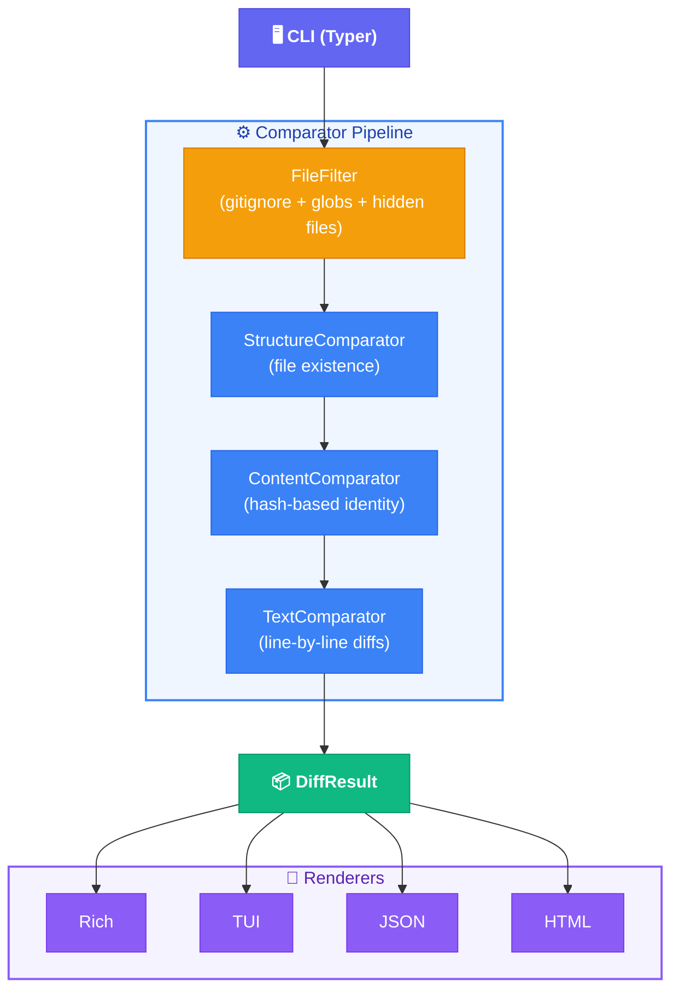

# Compare files and directories with clarity


[](https://www.python.org/downloads/)
[](pyproject.toml)
[](LICENSE)
[](https://docs.astral.sh/ruff/)
[](https://mypy-lang.org/)
[](https://docs.astral.sh/uv/)

A Python CLI/TUI tool that performs diff operations at multiple depth levels --
from simple "what files exist" to full text diffs with syntax highlighting.

## Features

- **Structure comparison** -- which files exist in each directory (contents don't matter)
- **Content comparison** -- which files are identical vs modified (hash-based)
- **Text comparison** -- line-by-line diffs with context and syntax highlighting
- **Smart defaults** -- respects `.gitignore`, ignores hidden files, auto-detects depth
- **Multiple outputs** -- Rich terminal, interactive TUI, JSON, HTML export
- **Flexible filtering** -- glob include/exclude, gitignore override, hidden file toggle

## Installation

```bash
# Install from source with uv
uv tool install .

# Or run directly during development
uv run deep-diff --help
```

## Usage

```bash
# Compare two directories (auto-detects: structure comparison)
deep-diff src/ other-src/

# Compare two files (auto-detects: text diff)
deep-diff file_a.py file_b.py

# Explicit depth levels
deep-diff src/ other-src/ --depth structure   # which files exist
deep-diff src/ other-src/ --depth content     # binary same/different
deep-diff src/ other-src/ --depth text        # full text diffs

# Short form
deep-diff src/ other-src/ -d s    # structure
deep-diff src/ other-src/ -d c    # content
deep-diff src/ other-src/ -d t    # text

# Output modes
deep-diff src/ other-src/ --output tui     # interactive TUI
deep-diff src/ other-src/ --output json    # machine-readable JSON
deep-diff src/ other-src/ --output html    # HTML export

# Filtering
deep-diff src/ other-src/ --no-gitignore       # don't respect .gitignore
deep-diff src/ other-src/ --hidden             # include hidden files
deep-diff src/ other-src/ --include "*.py"     # only Python files
deep-diff src/ other-src/ --exclude "*.pyc"    # exclude compiled files

# Other options
deep-diff src/ other-src/ --stat               # summary statistics only
deep-diff src/ other-src/ --context 5          # 5 lines of context (text depth)
deep-diff src/ other-src/ --hash md5           # use MD5 instead of SHA-256
```

## Defaults

| Setting | Default | Override |
|---------|---------|---------|
| Respect .gitignore | Yes | `--no-gitignore` |
| Include hidden files | No | `--hidden` |
| Depth (directories) | structure | `--depth content\|text` |
| Depth (files) | text | `--depth structure\|content` |
| Output mode | rich | `--output tui\|json\|html` |
| Context lines | 3 | `--context N` |
| Hash algorithm | sha256 | `--hash ALGO` |

## Documentation

For the full user guide, see **[docs/userGuide](docs/userGuide/README.md)**. Highlights:

- [Depth Levels](docs/userGuide/depth-levels.md) -- structure vs content vs text
- [Output Modes](docs/userGuide/output-modes.md) -- Rich, TUI, JSON, HTML
- [Filtering](docs/userGuide/filtering.md) -- gitignore, hidden files, include/exclude globs
- [Git Refs](docs/userGuide/git-refs.md) -- compare branches, tags, and commits
- [Watch Mode](docs/userGuide/watch-mode.md) -- live re-diffing on file changes
- [Snapshots](docs/userGuide/snapshots.md) -- save results, compare against baselines
- [Plugins](docs/userGuide/plugins.md) -- JSON/YAML structural diffing
- [Quick Reference](docs/userGuide/quick-reference.md) -- all flags + copy-paste recipes

## Development

```bash
# Install dependencies (including dev group)
uv sync --all-groups

# Run the CLI
uv run deep-diff --help

# Run tests
uv run pytest

# Run linter
uv run ruff check src/

# Run formatter
uv run ruff format src/

# Run type checker
uv run mypy src/

# Install git hooks (requires lefthook)
lefthook install
```

## Architecture

deep-diff uses a layered comparison pipeline:



Each stage produces immutable results. Higher stages enrich lower-stage results without mutation.

## License

MIT
