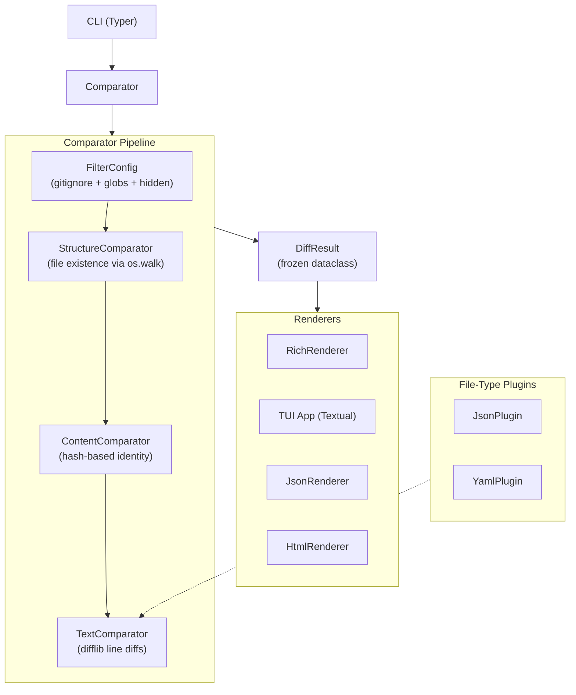

# Architecture

## Overview

deep-diff is a CLI/TUI tool that compares files and directories at three depth
levels: structure (what exists), content (hash-based identity), and text
(line-by-line diffs). It uses a layered pipeline where each stage enriches the
results of the previous stage without mutation.

## Design Principles

1. **Immutability** — all result types (`DiffResult`, `FileComparison`, `Hunk`,
   `TextChange`, `DiffStats`) are frozen dataclasses. Each pipeline stage
   produces new objects rather than mutating existing ones.

1. **Layered enrichment** — the comparator pipeline flows
   Structure -> Content -> Text. Running at `--depth content` executes both the
   structure and content stages. Each stage builds on prior results.

1. **Protocol-based extensibility** — renderers implement `Renderer` and
   `WatchRenderer` protocols (not ABC inheritance). This allows any object with
   the right methods to act as a renderer without coupling to a base class.

1. **Lazy loading** — the TUI (`textual`) is only imported when
   `--output tui` is selected, keeping the default CLI startup fast.

1. **Plugin system** — file-type plugins (JSON, YAML) register via Python
   entry points and replace the default `TextComparator` for matching files.

## Component Architecture

### CLI layer — `src/deep_diff/cli/`

Typer-based entry point. Parses arguments, constructs the `Comparator` with the
requested depth and options, dispatches to the appropriate renderer.

### Core pipeline — `src/deep_diff/core/`

| Module | Responsibility |
|---|---|
| `models.py` | Enums and frozen result dataclasses |
| `filtering.py` | `FilterConfig` — gitignore, glob include/exclude, hidden files |
| `structure.py` | `StructureComparator` — walks trees, classifies added/removed/common |
| `content.py` | `ContentComparator` — hashes files to find identical vs modified |
| `text.py` | `TextComparator` — line-by-line diffs via `difflib` |
| `comparator.py` | `Comparator` — orchestrator chaining stages by depth |
| `diff_utils.py` | Shared utilities |
| `plugins.py` | `PluginRegistry` and `FileTypePlugin` protocol |
| `snapshot.py` | Save/load results for baseline comparisons |
| `watcher.py` | File system watcher for live re-diffing |

### Git integration — `src/deep_diff/git/`

| Module | Responsibility |
|---|---|
| `resolver.py` | Resolves git refs (branches, tags, commits) to filesystem paths |
| `commands.py` | Executes git commands for ref comparison |

### Output layer — `src/deep_diff/output/`

| Module | Responsibility |
|---|---|
| `base.py` | `Renderer` and `WatchRenderer` protocols |
| `rich_output.py` | Rich terminal renderer with syntax highlighting |
| `json_output.py` | JSON export renderer |
| `html_output.py` | HTML export renderer |

### TUI — `src/deep_diff/tui/`

Textual-based interactive application with diff tree navigation,
side-by-side diff panels, and a status bar. Lazy-imported only when needed.

### Plugins — `src/deep_diff/plugins/`

Built-in plugins for structural diffing of JSON and YAML files. Registered
via `[project.entry-points."deep_diff.plugins"]` in `pyproject.toml`.

## Data Flow

A typical comparison request flows through these stages:

1. **CLI** parses arguments, constructs `Comparator` with depth + options
1. **FilterConfig** determines which files to include/exclude
1. **StructureComparator** walks both trees, produces `FileComparison` objects
   with `added`/`removed`/`identical` status (identical at this stage means
   "exists in both")
1. **ContentComparator** (if depth >= content) hashes common files, updates
   status to `identical` or `modified`
1. **TextComparator** (if depth = text) generates `Hunk`/`TextChange` objects
   for modified files using `difflib.SequenceMatcher`
1. **Comparator** assembles `DiffResult` with all comparisons and `DiffStats`
1. **Renderer** receives `DiffResult` and writes output

## Key Types

- `DiffResult` — top-level result containing left/right roots, depth,
  all file comparisons, and summary stats
- `FileComparison` — per-file result with status, paths, optional hunks and
  content hashes
- `Hunk` — contiguous block of text changes with line ranges
- `TextChange` — single line change with type (insert/delete/substitute/equal)
- `DiffStats` — count of identical/modified/added/removed files

## Extension Points

- **New renderer:** implement the `Renderer` protocol
  (`render(DiffResult) -> None`, `render_stats(DiffStats) -> None`)
- **New file-type plugin:** implement `FileTypePlugin` protocol, register via
  entry point in `pyproject.toml`
- **New depth level:** add to `DiffDepth` enum, implement comparator stage,
  wire into `Comparator` orchestrator

## Dependencies

| Package | Why |
|---|---|
| typer | CLI framework with type-hint-based argument parsing |
| rich | Terminal formatting, tables, syntax highlighting |
| textual | TUI framework (lazy-loaded) |
| pathspec | .gitignore pattern matching |
| difflib (stdlib) | Line-by-line text diffing |
| watchfiles | File system watching for live mode |
| pyyaml | YAML plugin support |

## Architecture Decision Records

See [docs/adr/](adr/) for recorded architectural decisions.
