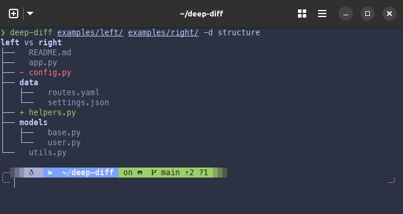
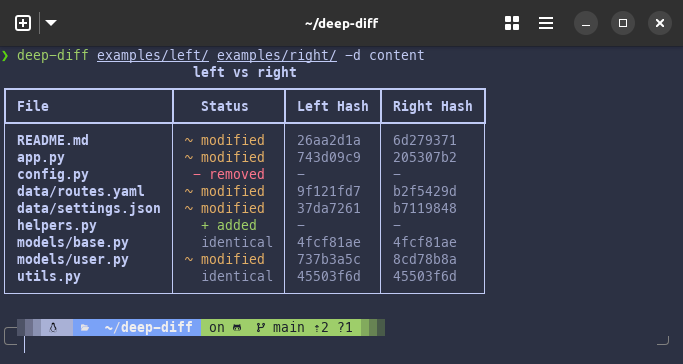
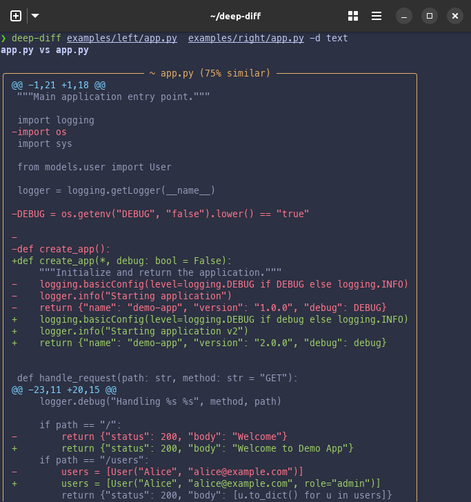

# Depth Levels

deep-diff compares at three depth levels, each building on the previous one. Use `--depth` (or `-d`) to choose.

## Structure — what files exist

```bash
deep-diff src/ other-src/ --depth structure
# Short form
deep-diff src/ other-src/ -d s
```

Shows which files are present in each directory. File contents are never read — only the file tree is compared.



**When to use:** Quick overview of what changed. Fastest depth — no file I/O beyond directory listing.

## Content — binary same or different

```bash
deep-diff src/ other-src/ --depth content
# Short form
deep-diff src/ other-src/ -d c
```

Hashes each file (SHA-256 by default) to determine whether contents are identical or modified.
Does not show *what* changed — just *whether* it changed.



**When to use:** You care about *which* files changed but don't need the line-by-line details.
Good for large directories where text diffs would be overwhelming.
You can change the hash algorithm with `--hash` (see [Advanced](advanced.md)).

## Text — line-by-line diffs

```bash
deep-diff src/ other-src/ --depth text
# Short form
deep-diff src/ other-src/ -d t
```

Produces unified diffs with context lines, similarity percentages, and color-coded output.



**When to use:** You want to see exactly what changed, line by line. This is the most detailed (and slowest) depth.

Control how many surrounding lines appear around each change with `--context` (default: 3):

```bash
deep-diff src/ other-src/ -d t --context 10
```

## Summary

| Depth | Flag | Short | Reads Contents? | Shows Diffs? |
|-------|------|-------|-----------------|-------------|
| Structure | `--depth structure` | `-d s` | No | No |
| Content | `--depth content` | `-d c` | Yes (hash only) | No |
| Text | `--depth text` | `-d t` | Yes (full read) | Yes |

______________________________________________________________________

Next: [Output Modes](output-modes.md) | [Back to Guide](README.md)
