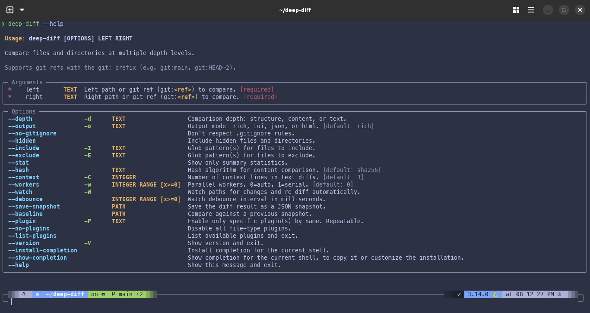

# Getting Started

## Installation

deep-diff requires Python 3.11+.

```bash
# Install as a standalone tool (recommended)
uv tool install .

# Or run directly from the project without installing
uv run deep-diff --help
```

After installing, verify it works:

```bash
deep-diff --version
```

```text
deep-diff 0.1.0
```

## Basic Usage

deep-diff takes two positional arguments — a **left** path and a **right** path:

```bash
deep-diff <left> <right>
```

These can be files, directories, or [git refs](git-refs.md).

## Auto-Detection

When you don't specify a `--depth`, deep-diff picks the right one for you:

| Inputs | Default Depth | Why |
|--------|---------------|-----|
| Two directories | `structure` | Shows which files exist in each |
| Two files | `text` | Shows a full line-by-line diff |
| One file + one directory | Error | Mixed types can't be compared |

```bash
# Auto-detects structure (two directories)
deep-diff src/ other-src/

# Auto-detects text (two files)
deep-diff config.json config.json.bak
```

You can always override auto-detection with `--depth` (see [Depth Levels](depth-levels.md)).

## Getting Help

```bash
# Full help with all flags
deep-diff --help
```



______________________________________________________________________

Next: [Depth Levels](depth-levels.md) | [Back to Guide](README.md)
