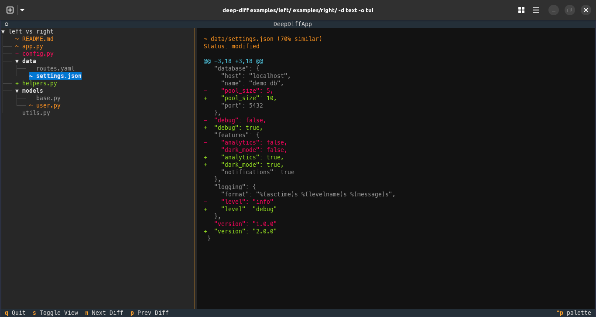
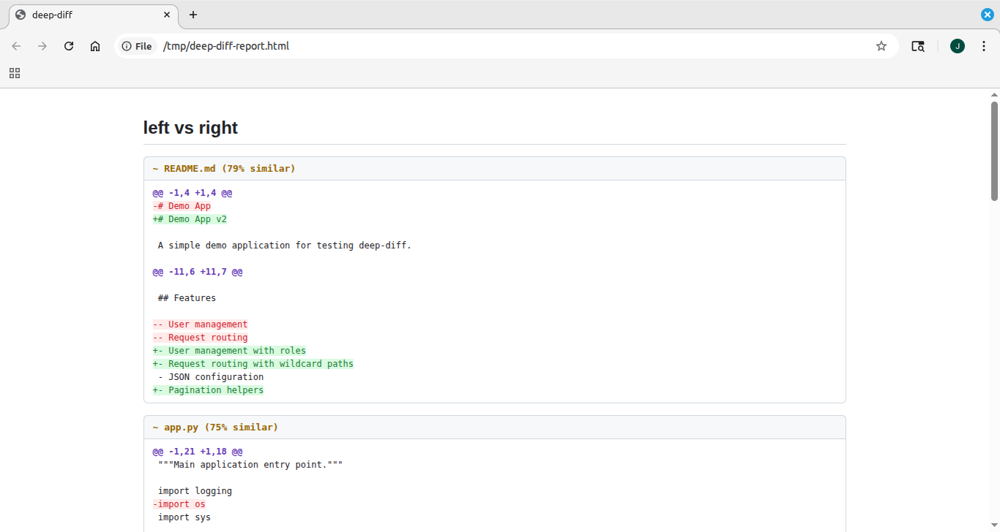

# Output Modes

deep-diff supports four output formats via `--output` (or `-o`). The default is `rich`.

## Rich — terminal rendering (default)

```bash
deep-diff src/ other-src/
# Explicit:
deep-diff src/ other-src/ --output rich
```

Color-coded output in your terminal. Rendering adapts to the depth level:

- **Structure**: nested tree with color-coded file status
- **Content**: table with file status and truncated hashes
- **Text**: unified diff panels with similarity percentages

This is what you'll see in most examples throughout this guide.

## TUI — interactive browser

```bash
deep-diff src/ other-src/ --output tui
# Short form
deep-diff src/ other-src/ -o tui
```

Opens a full-screen interactive terminal UI built with [Textual](https://textual.textualize.io/).
Navigate the file tree on the left, view diffs on the right.



### TUI Keybindings

| Key | Action |
|-----|--------|
| `q` | Quit |
| `s` | Toggle between full-tree and split (tree + detail) view |
| `n` | Jump to the next modified/added/removed file |
| `p` | Jump to the previous modified/added/removed file |
| Arrow keys | Navigate the file tree |
| Enter | Select a file to view its detail |

## JSON — machine-readable

```bash
deep-diff src/ other-src/ -d content -o json
```

Writes the full `DiffResult` as JSON to stdout. Pipe it to `jq`, save to a file, or feed it into another tool.

```json
{
  "left_root": "/path/to/src",
  "right_root": "/path/to/other-src",
  "depth": "content",
  "comparisons": [
    {
      "relative_path": "config.py",
      "status": "modified",
      "content_hash_left": "a1b2c3d4...",
      "content_hash_right": "e5f6a7b8..."
    }
  ],
  "stats": {
    "total_files": 4,
    "identical": 1,
    "modified": 1,
    "added": 1,
    "removed": 1
  }
}
```

Useful patterns:

```bash
# Save to file
deep-diff src/ other-src/ -d text -o json > diff.json

# Extract just modified files with jq
deep-diff src/ other-src/ -d content -o json | jq '.comparisons[] | select(.status == "modified")'
```

## HTML — shareable report

```bash
deep-diff src/ other-src/ -d text -o html > report.html
```

Produces a standalone HTML document with GitHub-inspired styling.
Includes all CSS inline — no external dependencies. Open it in any browser.



Redirect stdout to a file since the HTML is written to stdout:

```bash
deep-diff src/ other-src/ -d text -o html > diff-report.html
open diff-report.html   # macOS
xdg-open diff-report.html  # Linux
```

## Summary-Only Mode

Add `--stat` to any output mode to show only the aggregate counts (no per-file details):

```bash
deep-diff src/ other-src/ --stat
```

```text
4 files compared: 1 added, 1 removed, 1 modified, 1 identical
```

`--stat` works with all output modes and all depth levels.
In the TUI, it shows a centered stats display instead of the file tree.

______________________________________________________________________

Next: [Filtering](filtering.md) | [Back to Guide](README.md)
