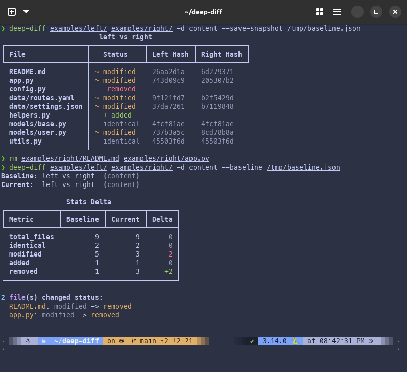

# Snapshots & Baselines

Snapshots let you save a diff result to disk and compare against it later.
This is useful for tracking drift over time or catching regressions in CI.

## Saving a Snapshot

```bash
deep-diff src/ other-src/ --save-snapshot baseline.json
```

This runs the comparison normally **and** writes the full result to `baseline.json`
as a versioned JSON file. The rendered output still appears in your terminal.

The snapshot file contains everything: file statuses, hashes, hunks, stats, and metadata.

## Comparing Against a Baseline

```bash
deep-diff src/ other-src/ --baseline baseline.json
```

Instead of rendering the normal diff output, this compares the **current** diff result
against the saved snapshot and shows what changed between the two runs:



The baseline report shows:

- **Stats delta**: side-by-side counts with +/- changes
- **Status changes**: files whose status flipped (e.g., modified -> identical)
- **Files no longer tracked**: present in baseline but missing now
- **New files tracked**: present now but missing from baseline

If nothing changed, you'll see:

```text
No changes from baseline.
```

## Save + Baseline in One Run

You can save a new snapshot and compare against an old one simultaneously:

```bash
deep-diff src/ other-src/ --baseline old.json --save-snapshot new.json
```

This saves the current result to `new.json` and renders the baseline comparison against `old.json`.

## Depth Mismatch Warning

If the baseline was saved at a different depth than the current run, you'll see a warning:

```text
Warning: baseline depth 'content' differs from current depth 'text'.
```

The comparison still runs, but the stats may not be directly comparable.

## Use Cases

### CI regression check

```bash
# In CI: compare against a committed baseline
deep-diff src/ vendor/ --depth content --baseline baselines/vendor.json

# Fail if the exit code is non-zero
```

### Track drift over time

```bash
# Week 1: save initial state
deep-diff prod-config/ staging-config/ --save-snapshot week1.json

# Week 2: check what changed
deep-diff prod-config/ staging-config/ --baseline week1.json --save-snapshot week2.json
```

______________________________________________________________________

Next: [Plugins](plugins.md) | [Back to Guide](README.md)
